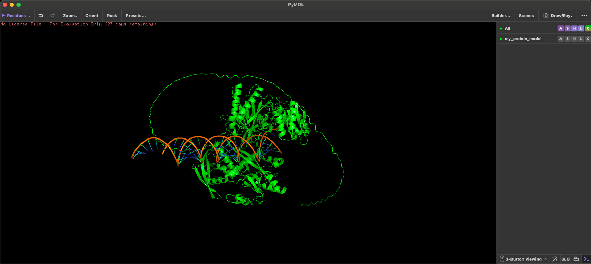

# Predicting Protein Structures with AlphaFold3 on the CHTC GPU Capacity

[](https://doi.org/10.5281/zenodo.19239059)

*Slides from the Feb. 11th training are available [here](https://docs.google.com/presentation/d/10-UUBKlYnul6KslN5slFQyCEebI6a0tyZwlucis-ynQ/edit?usp=sharing).*

## Introduction

A two-phase workflow: alignment generation → structure prediction

AlphaFold3 (AF3) predicts atomic-resolution biomolecular structures for proteins, nucleic acids, and complexes. This guide walks you through running AF3 on CHTC: organize your project, prepare input JSONs, submit HTCondor jobs, and transfer inputs/results using OSDF.

AlphaFold3 workloads in high-throughput environments are best organized into two separate job types:
* **Step 1: Generating the Alignments (Data-Only Pipeline)**
  * MMseqs2 search
  * HMMER search
  * Template retrieval (if enabled)
  * MSA + templates packaged into an AF3 “fold_input.json” 
* **Step 2: Predicting the Structure (Inference Pipeline)**
  * Load the precomputed fold_input.json 
  * Run the AF3 diffusion model 
  * Produce PDB models, ranking, trajectories, and metrics

This tutorial teaches you how to run AlphaFold3 on CHTC using a two-phase workflow and scalable, high-throughput compute practices. You will learn how to:

* **Understand the overall workflow of AlphaFold3 on CHTC**, including how the data-generation and inference stages map to CPU and GPU resources. 
* **Design, organize, and manage large-scale AF3 workloads**, including preparing inputs, structuring job directories, and generating automated job manifests. 
* **Leverage CHTC’s GPU capacity for high-throughput structure prediction**, including selecting appropriate resources based on input complexity. 
* **Use containers, staged databases, and HTCondor data-transfer** mechanisms to build reproducible, portable, and scalable AF3 workflows. 
* **Submit and monitor hundreds to thousands of AF3 jobs**, using standard HTCondor patterns and best practices for reliable execution on distributed compute sites.

All of these steps run across hundreds (or thousands) of jobs using the HTCondor workload manager and Apptainer containers to execute your software reliably and reproducibly at scale. The tutorial uses realistic genomics data and emphasizes performance, reproducibility, and portability. You will work with real data and see how high-throughput computing (HTC) can accelerate your workflows.


**Start here**
* [Introduction](#introduction)
* [Tutorial Setup](#tutorial-setup)
* [Understanding the AlphaFold3 Workflow](#understanding-the-alphafold3-workflow)
* [Running AlphaFold3 on CHTC](#running-alphafold3-on-chtc)
  + [Set Up Your Software Environment](#set-up-your-software-environment)
  + [Data Wrangling and Preparing AlphaFold3 Inputs](#data-wrangling-and-preparing-alphafold3-inputs)
  + [Preparing Your _List of (AlphaFold) Jobs_](#preparing-your-list-of-alphafold-jobs)
  + [Submit Your AlphaFold3 Jobs - CPU-Intensive Alignment Generation (Step 1)](#submit-your-alphafold3-jobs---cpu-intensive-alignment-generation-step-1)
	 - [AlphaFold3 Databases Availability on CHTC](#alphafold3-databases-availability-on-chtc)
  + [Submit Your AlphaFold3 Jobs - GPU-Accelerated Structural Prediction (Step 2)](#submit-your-alphafold3-jobs---gpu-accelerated-structural-prediction-step-2)
  + [Visualize Your AlphaFold3 Results](#visualize-your-alphafold3-results)
* [Next Steps](#next-steps)
* [Reference Material](#reference-material)
  + [Overview: AlphaFold3 Data Pipeline Executable (Data-Only Stage)](#overview-alphafold3-data-pipeline-executable-data-only-stage)
  + [Overview: AlphaFold3 Inference Pipeline Executable](#overview-alphafold3-inference-pipeline-executable)
  + [Glossary](#glossary)
  + [Software](#software)
  + [Data](#data)
  + [GPUs](#gpus)
* [Getting Help](#getting-help)


<!-- TOC end -->


## Tutorial Setup

### Before You Begin

You will need the following before moving forward with the tutorial:

1. [X] A CHTC HTC account. If you do not have one, request access at the [CHTC Account Request Page](https://chtc.cs.wisc.edu/uw-research-computing/form.html).
1. [X] A CHTC "staging" folder. 
2. [X] Basic familiarity with HTCondor job submission. If you are new to HTCondor, complete the CHTC ["Roadmap to getting started
"](https://chtc.cs.wisc.edu/uw-research-computing/htc-roadmap/) and read the ["Practice: Submit HTC Jobs using HTCondor"](https://chtc.cs.wisc.edu/uw-research-computing/htcondor-job-submission).
3. [X] AlphaFold3 Model Weights. Request the AF3 model weights from the [DeepMind AlphaFold Team](https://github.com/google-deepmind/alphafold3/blob/main/docs/installation.md#obtaining-model-parameters).

> [!WARNING]
> Requesting AlphaFold3 model weights requires agreeing to DeepMind's terms of service. Ensure you comply with all licensing and usage restrictions when using AF3 for research. This tutorial does not distribute AF3 model weights. **Requesting the weights can take up to several weeks.** Ensure you have them before starting the tutorial.

This tutorial also assumes that you:

* Have basic command-line experience (e.g., navigating directories, using bash, editing text files)
* Have sufficient disk quota and file permissions in your CHTC `/home` and `/staging` directories

> [!NOTE]
> If you are new to running jobs on CHTC, complete the CHTC ["Roadmap to getting started
"](https://chtc.cs.wisc.edu/uw-research-computing/htc-roadmap/) and our ["Practice: Submit HTC Jobs using HTCondor"](https://chtc.cs.wisc.edu/uw-research-computing/htcondor-job-submission) guide before starting this tutorial.

### Time Estimation
Estimated time: plan ~1–2 hours for the tutorial walkthrough. Each pipeline execution typically takes 30 minutes or more depending on sequence length, alignment depth, database location, and cluster load. Small test runs using `USE_SMALL_DB=1` often complete in 10–30 minutes.

The data-pipeline stage can be run with different CPU/worker settings. Single-core mode improves matchability and can increase overall throughput across many independent jobs, but each individual job may take substantially longer. For full-database jobs in single-core mode, expect runtimes of 1.5+ hours per query sequence, and potentially longer for conserved proteins with deep alignments.

### Clone the Tutorial Repository

1. Log into your CHTC account:
    
    ```bash
    ssh user.name@ap####.chtc.wisc.edu
    ```

2. To obtain a copy of the tutorial files, you can:

* Clone the repository:

  ```bash
  git clone https://github.com/CHTC/tutorial-CHTC-AF3.git
  cd tutorial-CHTC-AF3/
  ```

3. Create a directory in your `/staging/<netid>/` path titled `tutorial-CHTC-AF3`.

    ```bash
    mkdir -p /staging/<netid>/tutorial-CHTC-AF3/
    ```
  
4. Upload your AlphaFold3 Model Weights (`af3.bin.zst`) to `/staging/<netID>/tutorial-CHTC-AF3/`

    You should upload your AlphaFold3 model weights (`af3.bin.zst`) to this path. If you do not already have them, you will need to obtain them from the [DeepMind AlphaFold Team](https://github.com/google-deepmind/alphafold3/blob/main/docs/installation.md#obtaining-model-parameters). **You MUST have these weights before proceeding as they are required to run the inference pipeline of AlphaFold3.** Model weights can take several days to weeks to be approved. 

    You can upload your `af3.bin.zst` using `scp`, `sftp`, `rsync` or another file transfer client, such as Cyberduck or WinSCP. For more information about uploading files to CHTC, visit our [Transfer Files between CHTC and your Computer](https://chtc.cs.wisc.edu/uw-research-computing/transfer-files-computer) guide. 

#### About the Dataset

A set of sample sequences has been included with this repository under `Toy_Dataset/input.csv`. You can use this CSV "manifest" file with the `scripts/generate_job_directories.py` helper script, as described in [Setting Up AlphaFold3 Input JSONs and Job Directories](#setting-up-alphafold3-input-jsons-and-job-directories). The sample data includes four different sequences types to illustrate different AlphaFold use cases:

1) Single-protein: the [_Sabethes Cyaneus_](https://en.wikipedia.org/wiki/Sabethes_cyaneus) Piwi protein
2) Protein-RNA:  the [_Aedes aegypti_](https://en.wikipedia.org/wiki/Aedes_aegypti) Piwi protein complexed with a piwi-interacting RNA. 
3) Protein-RNA-RNA: [_Aedes albopictus_](https://en.wikipedia.org/wiki/Aedes_albopictus) Piwi protein complexed with a piwi-interacting RNA and a target RNA. 
4) Protein complex: A tetrameric complex of the [_Aedes aegypti_](https://en.wikipedia.org/wiki/Aedes_aegypti) Actin protein. 

## Understanding the AlphaFold3 Workflow

AlphaFold3 (AF3) uses a two-stage workflow that first converts sequences into features (MSAs, templates) and then uses a diffusion model to predict 3D structures: 

- **Stage 1 - Data pipeline (CPU)**: runs sequence searches and builds feature files (MSAs, templates, other inputs). This step utilizes large sequence databases and the disk space requirement (~750GB) is typically a significant bottleneck for large batches of jobs. 
- **Stage 2 - Inference Pipeline (GPU)** : loads feature files and model weights to produce predicted structures and metrics.

Running the AlphaFold workflow as two independent stages allows you to manage the needed computational resources (CPUs vs GPUs) more efficiently to maximize your throughput on the system. Separating the stages also allows for reuse, as the outputs of the data pipeline, such as your alignments, can be used for the inference pipeline when for jobs with shared biomolecules (for example, screening multiple ligands binding to the same protein).

### The CPU-Only Pipeline: Generating Alignments (Stage 1)

The first stage of AlphaFold3 prepares all input features needed for structure prediction. This step is entirely CPU-driven and dominated by database searches and feature construction.

**What the data pipeline does (CPU-only)**

- Inputs: your `fold_input.json` files and the AF3 reference databases.
- Actions: run MMseqs2/HMMER searches, fetch templates (when enabled), and build MSA/template feature bundles.
- Outputs: per-job feature directories packaged as `<job>.data_pipeline.tar.gz` for the inference stage.

Notes:
- Data-stage jobs are CPU-bound and scale to many sequences in parallel across different machines.
- AF3 databases are large (~750 GB); use CHTC execution points (EPs) with pre-staged databases when available to avoid repeated transfers and long queue waits.

#### MSA CPU and Worker Settings

The data pipeline uses HMMER-based searches to generate alignments. The `data_pipeline.sh` wrapper exposes two options that control how much CPU parallelism each data-pipeline job uses:

- `--msa_cpus_per_worker <N>` controls how many CPUs each individual Jackhmmer/Nhmmer search may use. The default is `1`.
- `--msa_workers <N>` controls how many MSA searches may run at the same time. If this option is not provided, the wrapper uses `PYTHON_CPU_COUNT` when it is available, otherwise it defaults to `1`.

The approximate CPU demand of the MSA stage is:

```text
estimated MSA CPU use = msa_cpus_per_worker × msa_workers
```

For OSPool-style high throughput, we generally recommend keeping `--msa_cpus_per_worker 1` and scaling with `--msa_workers`. For example, a 4-core data-pipeline job should usually run as `--msa_cpus_per_worker 1 --msa_workers 4`, rather than `--msa_cpus_per_worker 4 --msa_workers 1`. This keeps each HMMER process simple to account for while still allowing multiple independent database searches to run concurrently.

When the estimated MSA CPU use is `1`, the wrapper prints a warning to both stdout and stderr that the job is running in single-core mode. This is valid and often useful for high-throughput runs, but users should expect longer per-job runtimes.

#### MSA Caching and Reuse

The data pipeline's main output is a feature bundle that includes MSAs and templates. If you have multiple jobs with shared sequences (e.g., the same protein with different ligands), you can reuse the same MSA outputs across those jobs to save time and resources. AlphaFold3 workflows often spend substantial CPU time in the data pipeline searching large sequence databases to build MSAs. Across a community of users, many protein chains, protein families, organisms, and benchmark inputs may be searched repeatedly. To support reuse of these precomputed alignments, the Partnership to Advance Throughput Computing (PATh) has developed an alignment library and caching mechanism that allows users reuse alignments in subsequent jobs.

The alignment library reduces duplicated work by allowing those precomputed alignments to be reused when the sequence, source, and provenance are appropriate for the user's workflow.

 - Faster cache-aware runs — jobs that find an acceptable cached MSA can skip part or all of the repeated sequence-search stage for that chain.
 - Lower CPU and storage pressure — repeated database searches are replaced with OSDF/Pelican reads of smaller alignment artifacts.
 - Reproducibility and provenance — cached records include source and checksum metadata so users can distinguish generated, imported, and community-contributed alignments.
 - Community reuse — every validated contribution can make later structure-prediction workflows faster for other researchers.

To use this feature, you can pass the `--use-cached-msa` flag to the `data_pipeline.sh` wrapper when running your data pipeline jobs. This will enable the wrapper to check the alignment library for existing MSAs that match the input sequence and search parameters before performing new database searches. If a suitable cached MSA is found, it will be reused for the current job, saving time and computational resources. When opting into this feature, you should also consider passing the `--cache_preferred_sources` flag, which will prioritize cached MSAs from preferred sources (e.g., those generated by Google DeepMind, OSG-Staff, or from trusted community contributions) for contributed MSAs. If the flag is not passed, the wrapper will use the default source preference order [OSG-Generated --> Google DeepMind --> Community Contributed --> Others]. 

The full list of alignment sources is as follows:
- `OSG-Generated`: Alignments generated by CHTC users on OSG resources.
- `Google DeepMind`: Alignments generated by Google DeepMind, the creators of AlphaFold3.
- `Community Contributed`: Alignments contributed by the broader scientific community, which may include researchers outside of CHTC.
- `Nvidia`: Alignments generated by Nvidia's BioNeMo team, a major technology company that develops GPUs and AI software, in work related to OpenFold, an open-source implementation of AlphaFold. The NVIDIA dataset provides predicted homodimer structures for approximately 1.7 million sequences derived from Swiss-Prot, the WHO list, and model reference proteomes.
- `BFVD` (“Big Fantastic Viral Database”): Alignments generated from the BFVD, a large database of viral sequences that has been used in some AlphaFold3 studies.
- `Viro3D`: Alignments generated from the Viro3D team, a large database of viral protein structures, generated at the University of Glasgow's Center for Virus Research.
- `AllTheBacteria`: Alignments generated from the All The Bacteria team, a large database of pan-bacterial protein MSAs.
- `Kinetoplastid`: Alignments generated from the Viro3D team, a resource of enhanced Multiple Sequence Alignments (MSAs) for improved structure predictions of proteins from Trypanosoma, Leishmania, and related kinetoplastid parasites.

> [!TIP]
> **Interested in contributing your alignments to the library?**
> AlphaFold3 data pipeline jobs that are ran with the `--use-cached-msa` flag will automatically contribute their generated MSAs to the alignment library, along with metadata about the source and provenance of the alignment. If you want to contribute alignments from previous runs, or from runs that were not ran with the `--use-cached-msa` flag, please contact the PATh team at [support@osg-htc.org](mailto:support@osg-htc.org) for guidance on how to contribute your alignments to the library.

You can learn more about the alignment library and caching mechanism in the [OSG/PATh documentation](https://path-cc.io/alignments/).

### The GPU-Accelerated Pipeline: Structural Prediction (Stage 2)
Once the data pipeline has produced MSAs and templates, AF3’s second stage uses this information to generate atomic-resolution structural models.

**What the inference pipeline does (GPU)**

- Inputs: feature tarballs from the data pipeline (`<job>.data_pipeline.tar.gz`) and AF3 model weights (`af3.bin.zst`).
- Actions: expand features, load model weights, run AF3 inference to generate structures and confidence metrics.
- Outputs: `<job>.inference_pipeline.tar.gz` containing ranked PDBs and metadata.

Notes:
- Inference is GPU-bound and requires selecting GPUs with sufficient memory for your token count. You can learn more about our recommended GPU memory requirements by reviewing the [Key AF3 GPU considerations](#key-af3-gpu-considerations) section at the end of this tutorial. 
- Use unified memory mode for very large jobs (see the `--enable_unified_memory` option), but expect slower performance.

## Running AlphaFold3 on CHTC

### Set Up Your Software Environment
CHTC provides a shared Apptainer container for AF3 (recommended). If you prefer a custom image, build a Docker image locally and convert it to an Apptainer image on the Access Point (steps below).

<details>
<summary>Click to expand: Building Your Own AlphaFold3 Apptainer Container (Advanced)</summary>

1. On your local machine, clone the AlphaFold3 repository:
    
    ```bash
    git clone https://github.com/google-deepmind/alphafold3.git
    ```

2. Navigate to the `alphafold3/` directory:

    ```bash
    cd alphafold3/
    ```
   
3. Build a docker image using the provided `Dockerfile`:

    ```bash
    docker build -t alphafold3:latest ./docker/
    ```
   
4. Push the docker image to a container registry (e.g., Docker Hub, Google Container Registry):

    ```bash
    docker tag alphafold3:latest <your-dockerhub-username>/alphafold3:latest
    docker push <your-dockerhub-username>/alphafold3:latest
    ```
   
5. On your CHTC Access Point, pull the docker image and convert it to an Apptainer image:

    ```bash
    apptainer build alphafold3.sif docker://<your-dockerhub-username>/alphafold3:latest
   ```
</details>

### Data Wrangling and Preparing AlphaFold3 Inputs

Alphafold3 requires input JSON files that contain the input query sequence(s) along with their corresponding metadata, such as chain IDs, sequence names, and molecule type. Additionally, if you are using precomputed MSAs and templates, these JSON files should also reference the paths to them. 

For this tutorial, we will create individual JSON files for each protein sequence. Each AlphaFold3 job will have its own directory containing the input JSON file and any associated supporting files, such as

```bash
./AF3_Jobs/Job3_ProteinZ/
├── data_inputs                            # data_inputs directory for the data pipeline
│   └── fold_input.json              # input JSON for data pipeline
└── inference_inputs                       # inference_inputs directory for the GPU inference pipeline
└── <error and output files>             # stdout/stderr files will be written here
```

This directory structure will be used for each sequence prediction workflow. While you could make these folders and input structure yourself, we've created a helper script that will a) generate the directories for you and b) create the correct initial input file (`fold_input.json`) in each job folder. The script requires a manifest file of sequences. For this tutorial, there is an existing manifest file in the `Toy_Dataset` directory. 

1. Run the helper script in `scripts/generate-job-directories.py` to read the CSV manifest and create the necessary job directories and input JSON files for each protein sequence.:

    ```bash
   python3 ./scripts/generate-job-directories.py --manifest Toy_Dataset/input.csv --output_dir ./AF3_Jobs/
    ```

2. Verify that the job directories and input JSON files have been created correctly:

    ```bash
   tree AF3_Jobs/
   ```

   You should see a list of job directories corresponding to each protein sequence in your CSV manifest:

   ```bash
    AF3_Jobs/
    ├── Job1_XP_053696736.1_Sabethes_cyaneus
    │   ├── data_inputs
    │   │   └── fold_input.json
    │   └── inference_inputs
    ├── Job2_XP_001663870.2_Aedes_aegypti
    │   ├── data_inputs
    │   │   └── fold_input.json
    │   └── inference_inputs
    ├── Job3_XP_029709661.2_Aedes_albopictus
    │   ├── data_inputs
    │   │   └── fold_input.json
    │   └── inference_inputs
    └── Job4_XP_001659963.1_Aedes_aegypti_Actin
        ├── data_inputs
        │   └── fold_input.json
        └── inference_inputs
   ```

3. View the contents of `Toy_Dataset/input.csv` to understand the format of the manifest file:

    ```bash
    column -s, -t Toy_Dataset/input.csv | less -S
    ```

    The CSV should look like this:

    ```bash
    job_name                            mol1_type  mol1_chain  mol1_seq                                                                                                   >
    XP_053696736.1_Sabethes_cyaneus     protein    A           MADRHSQGRARARGYAVGSSSHESREGRGQVPVRGSGVGIPGQGPRPAWGQPGGGEGRASVHRDSSAGRHGSSSGGNGNGNGAGTSASGGAGTSRGAMRGRRTIGDT>
    XP_001663870.2_Aedes_aegypti        protein    A           MADRQPVRRARARGYTAVSVSHESRQGRGQPPVRGSGVAVSGPRPSFQHPGAEGRAVTYHEGSAGRGAVSASTSGGGNGNGNGGDGNGNGAAAVASRGAMRGRRPVG>
    XP_029709661.2_Aedes_albopictus     protein    A           MSDRQSQGRARARGYTAVNLSHEAREGRGQAPVRGSGVGVSGPRPTFQHPGAEGRAMTHRDASAGRGASSSTSGNGNGNGNGAAAAGPSRGAMRGRRGVADTLRTRA>
    XP_001659963.1_Aedes_aegypti_Actin  protein    A|B|C|D     MCDDDVAALVVDNGSGMCKAGFAGDDAPRAVFPSIVGRPRHQGVMVGMGQKDSYVGDEAQSKRGILTLKYPIEHGIITNWDDMEKIWHHTFYNELRVAPEEHPVLLT>
    (END)
   ```

Our data manifest file (`input.csv`) comes with four scenarios already. If you want to create your own file of inputs, read more below. 

<details><summary>Click to expand: Building Your Own Manifest File</summary>

1. Setup a CSV manifest containing your protein sequences in FASTA format in the `data/protein_sequences/` directory. The CSV should follow this format: 

    ```bash
    job_name,molecule_type,chain_id,sequence
    ProteinA,protein,A,MKTAYIAKQRQIS
    ProteinB,protein,A,GAVLILALLAVF
    ```
    
    If you plan to model multiple molecules, simply add more columns to the CSV manifest. For example, if you have two proteins complex or a protein and a DNA molecule, your CSV might look like this:
    
    ```bash
    job_name,molecule_type,chain_id,sequence
    ProteinA,protein,A,MKTAYIAKQRQIS,protein,B,MKTAYIAKQRQIS
    ProteinB,protein,A,GAVLILALLAVF,dna,B,GCGTACGTAGCTAGC
    ```
    
    You can also model multimeric complexes by including multiple chain_ids in the CSV manifest. Write each chain_id separated by a pipe character `(|)`. For example, if you have a trimeric protein complex, your CSV might look like this:
    
    ```bash
    job_name,molecule_type,chain_id,sequence
    ProteinComplex,protein,A|B|C,MKTAYIAKQRQIS
    ```
</details>

#### Preparing Your _List of (AlphaFold) Jobs_

To submit multiple AlphaFold3 jobs using HTCondor, you can create a "list of jobs" file that contains the names of each job directory you plan to run. This file will be used in your HTCondor submit file to specify which jobs to execute. If you are using the above helper script to generate your job directories, your list of jobs files will be generated automatically. If you are creating your own job directories, you can generate this file by listing the job directories in your `AF3_Jobs/` directory. The helper script will also generate a similar list of jobs files for your inference pipeline, which will be used in the second stage of the tutorial. This second file contains the same job information, plus additional columns that specify the minimum GPU memory requirements for each job, which will be used to request the appropriate GPU resources for each inference job. 

> [!NOTE]  
> Each line in `list_of_af3_jobs.txt` corresponds to a single AlphaFold3 job that will be executed using HTCondor. You can modify this file to add or remove jobs as needed. This file, functionally, is a one-column comma-separated values (CSV) file where each line represents a job name. You could add additional columns to this file if you wanted to pass more variables to your HTCondor jobs. For other ways to submit multiple jobs, see the CHTC documentation: [Submit Multiple Jobs Using HTCondor](https://chtc.cs.wisc.edu/uw-research-computing/multiple-jobs.html). 

<details><summary>Click to expand: Building Your Own List of Jobs File</summary> 

In this tutorial, we will create a "list of jobs" file that contains the names of each AlphaFold3 job directory we plan to run. This file will be used in our HTCondor submit file, using the `queue ... from` syntax to specify which jobs to execute.

1. Generate the "list of jobs" file by listing the job directories in your `AF3_Jobs/` directory:

    ```bash
    ls AF3_Jobs/ > list_of_af3_jobs.txt
    ```

1. Examine the contents of your "list of jobs" file:

    ```bash
    cat list_of_af3_jobs.txt
    ```

    It should return an list of directories such as:

    ```bash
    Job1_XP_053696736.1_Sabethes_cyaneus
    Job2_XP_001663870.2_Aedes_aegypti
    Job3_XP_029709661.2_Aedes_albopictus
    Job4_XP_001659963.1_Aedes_aegypti_Actin
    ```

</details>

### Submit Your AlphaFold3 Jobs - CPU-Intensive Alignment Generation (Step 1)

The data-pipeline stage prepares all alignments, templates, and features needed for AF3 prediction. These CPU-only jobs run on CHTC’s standard compute nodes and can be scaled to many sequences at once. In the steps below, you’ll submit one data-pipeline job per sequence, producing the feature tarballs required for the GPU inference stage. Note that this step requires a large (~750GB) database, which has been pre-staged on certain CHTC nodes. There are more details at the end of this section about how to best scale your work based on the size of the database. 


1. Change to your `tutorial-CHTC-AF3/` directory:
    ```bash
    cd ~/tutorial-CHTC-AF3/
   ```
2. Review the Data Pipeline executable script `scripts/data_pipeline.sh`. For this tutorial, no changes will be necessary. However, **when you are ready to run your own jobs, please review the details in [link to section](#overview-alphafold3-data-pipeline-executable-data-only-stage)**, as your AF3 jobs may require additional non-default options.

3. Create your submit file `data_pipeline.sub` in the top level of the cloned repository. The submit file below works out-of-the-box if you've setup your directories as specified in section [Setting Up AlphaFold3 Input JSONs and Job Directories](#data-wrangling-and-preparing-alphafold3-inputs)). You can specify additional parameters for the executable in the `arguments` attribute as needed. 

    ```bash
	# CHTC maintained container for AlphaFold3 as of December 2025
	# Can use the local CHTC copy at file:///staging/groups/chtc_staff/containers/alphafold3.minimal.22Jan2025.sif
	container_image = osdf:///osg-public/containers/alphafold3.minimal.22Jan2025.sif
	
	executable = scripts/data_pipeline.sh
	
	log = ./logs/data_pipeline.log
	output = data_pipeline_$(Cluster)_$(Process).out
	error  = data_pipeline_$(Cluster)_$(Process).err
	
	initialdir = AF3_Jobs/$(my_directory)
	transfer_input_files = data_inputs/
	
	# transfer output files back to the submit node
	transfer_output_files = data_pipeline.tar.gz
	transfer_output_remaps = "data_pipeline.tar.gz=inference_inputs/$(my_directory).data_pipeline.tar.gz"
	
	should_transfer_files = YES
	when_to_transfer_output = ON_EXIT
	
	# We need this to transfer the databases to the execute node
	Requirements = (Target.HasCHTCStaging == true) && (TARGET.HasAlphafold3 == true)
	
	# We use this condition for internal logic and reporting, please do not remove.
	+is_alphafold3 = true
	
	if defined USE_SMALL_DB
	  # testing requirements
	  request_memory = 8GB
	  request_disk = 16GB
 	 request_cpus = 4
	  arguments = --smalldb --work_dir_ext $(Cluster)_$(Process) --verbose
	else
	  # full requirements
	  request_memory = 8GB
	  # Request less disk if matched machine already has AF3 DB preloaded (650GB savings)
	  request_disk = 700000000 - ( (TARGET.HasAlphafold3?: 1) * 650000000)
 	 request_cpus = 8
 	 arguments = --work_dir_ext $(Cluster)_$(Proc)
	endif
	
	queue my_directory from list_of_af3_jobs.txt
   ```

In the full-database example above, each data-pipeline job requests 4 CPUs and passes `--msa_cpus_per_worker 1 --msa_workers 4` to the wrapper. This means the job may run up to four independent MSA searches concurrently, with each search using one CPU. For maximum opportunistic matchability, you can instead request one CPU and run with `--msa_workers 1`; this single-core mode is slower per job but may allow more jobs to run at once.

This submit file will read the contents of `list_of_af3_jobs.txt`, iterate through each line, and assign the value of each line to the variable `$(directory)`. This allows you to programmatically submit _N_ jobs, where _N_ equals the number of AlphaFold3 job directories you previously created. Each job processes one AlphaFold3 job directory and uses the CHTC-maintained AlphaFold3 container image, which is transferred to the Execution Point (EP) by HTCondor.

4. Submit your data-pipeline jobs:

    ```bash
   condor_submit scripts/data_pipeline.sub
   ```

> [!TIP]  
> You can test the data pipeline using reduced-size databases by defining the `USE_SMALL_DB=1` variable when submitting your jobs. This is useful for debugging and testing purposes, as it reduces resource requirements and speeds up job execution. To use the small database set, submit your jobs with the following command: 
> ```bash
> condor_submit USE_SMALL_DB=1 data_pipeline.sub
> ```

5. Track your job progress:

    ```bash
   condor_watch_q
   ```

#### Choosing Data-Pipeline CPU Settings

The best CPU setting depends on whether you want shorter runtimes for each individual job or higher overall throughput across many jobs.

| Goal | `request_cpus` | Recommended wrapper arguments | Notes |
|------|----------------|-------------------------------|-------|
| Maximum matchability / many independent jobs | `1` | `--msa_cpus_per_worker 1 --msa_workers 1` | Slowest per job, but easiest to match. Expect substantially longer runtimes. |
| Balanced OSPool default | `2` | `--msa_cpus_per_worker 1 --msa_workers 2` | Good compromise for many production runs. |
| Faster per-job runtime on pre-staged DB nodes | `4` | `--msa_cpus_per_worker 1 --msa_workers 4` | Runs multiple database searches concurrently. Recommended when database I/O is local and stable. |
| Single search using multiple CPUs | `4` | `--msa_cpus_per_worker 4 --msa_workers 1` | Useful when you want to avoid multiple simultaneous database scans, but usually not the preferred OSPool default. |

Do not set `--msa_cpus_per_worker × --msa_workers` higher than `request_cpus`. For example, if `request_cpus = 4`, avoid `--msa_cpus_per_worker 4 --msa_workers 4`, because that can create roughly 16 CPUs worth of MSA demand inside a 4-CPU allocation.

#### AlphaFold3 Databases on CHTC

This data stage requires the AlphaFold3 reference databases. CHTC maintains a full, pre-extracted copy of the AlphaFold3 reference databases on a subset of execute points. When your data-pipeline jobs match to one of these machines, they can use the local /alphafold3 directory directly, avoiding the costly transfer and extraction of several hundred gigabytes of database files. This dramatically reduces startup time, disk requirements, and overall job runtime. If a job lands on a machine without pre-staged databases, the script automatically falls back to unpacking the databases in the job’s scratch space, ensuring that every job can run regardless of where it matches.

You can target the pre-staged database nodes specifically by adding the requirement command `requirements = (HasAlphafold3 == true)` to your submit file, as shown in the example submit file above. 

The submit files will attempt to match to machines that are advertising the `HasAlphafold3` resource, which ensures that the necessary AlphaFold3 databases are transferred to the EP for each job. You can remove the `&& (TARGET.HasAlphafold3 == true)` clause from the `Requirements` attribute if you want to run jobs on machines with and without pre-staged databases. Removing this clause will increase the number of available machines for your jobs, leading to faster _start_ times for your jobs, but may also increase job runtime due to long database transfer times.

The included script (`data_pipeline.sh`) will also check the matched EP's information, after the job has matched, to see if the `HasAlphafold3` attribute is set to `true`. If it is, the job will request significantly less disk space, as the databases are already present on the machine. If the attribute is not set to `true`, the submit file will request more disk space to accommodate the database transfer. Lower disk requests can lead to increased number of running jobs, as the scheduler has more flexibility in matching jobs to machines.

> [!TIP]  
> AlphaFold3 jobs can be resource-intensive, especially with highly conserved query sequences. Conserved sequences can generate very deep alignments, which may require significantly more memory. If you encounter out-of-memory errors during job execution, consider increasing the `request_memory` attribute in your submit file. You can also utilize the `retry_request_memory = <memory/expression>` command in your submit file to request a retry if the job holds for an out-of-memory error. For more information on how to use `retry_request_memory`, visit our [Request variable memory](https://chtc.cs.wisc.edu/uw-research-computing/variable-memory#use-retry_request_memory) documentation page.

### Submit Your AlphaFold3 Jobs - GPU-Accelerated Structural Prediction (Step 2)

Once the data-pipeline jobs have finished generating alignments and features, the next stage is to run the AlphaFold3 inference pipeline on GPU-enabled execute points. This stage loads the model weights, expands the feature tarball from Step 1, and performs the diffusion-based structure prediction. Because inference is GPU-intensive, these jobs run on CHTC’s GPU Capacity, and can be scaled across many GPUs in parallel. In the steps below, you will set up a submit file that launches one inference job per sequence, each producing a final structure tarball ready for download and visualization.


1. Change to your `tutorial-CHTC-AF3/` directory:
    ```bash
    cd ~/tutorial-CHTC-AF3/
   ```

2. Review your Data Pipeline executable script `scripts/inference_pipeline.sh`. Generally, no changes will be necessary. However, **when you are ready to run your own jobs, please review the details in [link to section](#overview-alphafold3-inference-pipeline-executable)**, as your AF3 jobs may require additional non-default options.

3. Create your submit file `inference_pipeline.sub`. You will need to edit the `MODEL_WEIGHT_PATH` **and** `gpus_minimum_memory`. You can specify additional parameters for the executable in the `arguments` attribute as needed. 

    ```bash
    # CHTC maintained container for AlphaFold3 as of December 2025
	# Can use the local CHTC copy at file:///staging/groups/chtc_staff/containers/alphafold3.minimal.22Jan2025.sif
	container_image = osdf:///osg-public/containers/alphafold3.minimal.22Jan2025.sif
	
	executable = scripts/inference_pipeline.sh
	
	environment = "myjobdir=$(my_directory)"
	
	MODEL_WEIGHTS_PATH = /staging/<netID>/tutorial-CHTC-AF3/af3.bin.zst
	
	log = ./logs/inference_pipeline.log
	output = inference_pipeline_$(Cluster)_$(Process).out
	error  = inference_pipeline_$(Cluster)_$(Process).err
	
	initialdir = AF3_Jobs/$(my_directory)
	
	# transfer all files in the inference_inputs directory
	transfer_input_files = inference_inputs/, osdf:///chtc/$(MODEL_WEIGHTS_PATH)
	
	should_transfer_files = YES
	when_to_transfer_output = ON_EXIT
	
	request_memory = 8GB
	# need space for the container (3GB) as well
	request_disk = 10GB
	request_cpus = 1
	request_gpus = 1
	
	# Use the CHTC recommended AF3 memory requirement based on the number of tokens
	gpus_minimum_memory = $(AF3_vRAM) GB
	
	# short jobs 4-6 hours so it is okay to use is_resumable
	+GPUJobLength = "short"
	+WantGPULab = true
	+is_resumable = true
	want_ospool = true
	
	+is_alphafold3 = true
	
	# Use --user-specified-alphafold-options to pass any extra options to AlphaFold3, such as
	# arguments = --model_param_file af3.bin.zst --work_dir_ext $(Cluster)_$(Process) --user-specified-alphafold-options "--buckets 5982"
	arguments = --model_param_file af3.bin.zst --work_dir_ext $(Cluster)_$(Process)
	
	queue my_directory,AF3_vRAM from list_of_af3_inference_jobs.txt
   ```

    > [!IMPORTANT]  
    > Make sure to update the `MODEL_WEIGHTS_PATH` variable to point to the location of your `af3.bin.zst` model weights file in your CHTC staging directory. This path should be the same as where you uploaded your model weights in step 4 of the [Clone the Tutorial Repository](#clone-the-tutorial-repository) section. For example, if your CHTC netID is `bbdager`, and you uploaded your model weights to `/staging/bbdager/tutorial-CHTC-AF3/af3.bin.zst`, then you should set `MODEL_WEIGHTS_PATH = /staging/bbdager/tutorial-CHTC-AF3/af3.bin.zst` in your submit file.

This submit file will read the contents of `list_of_af3_jobs.txt`, iterate through each line, and assign the value of each line to the variable `$(directory)`. This allows you to programmatically submit _N_ jobs, where _N_ equals the number of AlphaFold3 job directories you previously created. Each job processes one AlphaFold3 job directory and uses the CHTC-maintained AlphaFold3 container image, which is transferred to the Execution Point (EP) by HTCondor.

The GPU-accelerated inference jobs do not require the full AlphaFold3 databases, so there is no need to check for pre-staged databases on the execute nodes. However, it does require the model weights to be transferred to the EP. The submit file above transfers the model weights specified in the `MODEL_WEIGHTS_PATH` variable to the EP for each job.

4. Submit your data-pipeline jobs:

    ```bash
   condor_submit scripts/inference_pipeline.sub
   ```

5. Track your job progress:

    ```bash
   condor_watch_q
   ```

This stage **does not** require the full AlphaFold3 databases, only the model weights and the feature tarballs produced in Step 1. As a result, you can run these jobs on a wider range of GPU Execute Points without worrying about database availability, including GPU EPs outside of CHTC on the OSPool. To learn more about using additional capacity beyond CHTC, visit our guide on [Scale Beyond Local HTC Capacity](https://chtc.cs.wisc.edu/uw-research-computing/scaling-htc). 

#### Choosing Appropriate GPU Resources

Beyond the model weights, your AlphaFold3 jobs may require different resource requests depending on the size and complexity of the proteins you are modeling. AlphaFold3 uses the concept of a "token" to represent the complexity of your protein. **You can generally estimate number of tokens as approximately equivalent to 1.2x the sequence length.** For example, a protein with 1000 amino acids would have roughly 1200 tokens. If you are modeling multimeric complexes, you will need to account for the combined sequence lengths of all chains. For structures that include nucleic acids (DNA/RNA), each nucleotide is considered one token. Post-translational modifications (PTMs) and additional ligands may also increase token counts, depending on the specific modifications involved. 

Once you know the number of "tokens" required, you can estimate how much GPU memory is needed to run your protein. As a starting point, you can refer to the following general guidelines:

| Tokens     | Estimated GPU Memory Requirement |
|------------|----------------------------------|
| Up to 1200 | 8-10 GB                          |
| 1200-1850  | 15-20 GB                         |
| 2000-3000  | 35-40 GB                         |
| Over 3000  | 70+ GB                           |

Change the `gpus_minimum_memory` option in the submit file to reflect the amount of GPU memory that is needed for your protein. 

For very large complexes exceeding 10k tokens, you may need to enable unified memory mode using the `--enable_unified_memory` flag in the executable script. This allows AlphaFold3 to utilize system RAM in addition to GPU memory, which can help accommodate larger models. However, it may also lead to **significantly slower performance** due to increased data transfer times between system RAM and GPU memory. You will also need to ensure that the execute node has sufficient system RAM to support unified memory mode by increasing the `request_memory` attribute in your submit file. We recommend reaching out to the CHTC Research Computing Facilitation team for assistance with very large complexes.

> [!TIP]  
> CHTC has a number of smaller RTX series GPUs (e.g., RTX 4000, RTX 5000) with only 8-16GB of GPU memory. If your job requires less than 10GB of GPU memory, you can set `gpus_minimum_memory = 10000` in your submit file to allow your jobs to match to these smaller GPUs. This can help increase the number of available machines for your jobs, leading to faster start times.
> 
> If your jobs require more GPU memory than is available on these smaller GPUs, you can adjust the `gpus_minimum_memory` attribute in your submit file to request machines with larger GPUs (e.g., A100, V100). For example, to request machines with at least 32GB of GPU memory, you can set `gpus_minimum_memory = 32000` in your submit file. This will help ensure that your jobs are matched to machines with sufficient GPU memory to run successfully.

### Visualize Your AlphaFold3 Results

AlphaFold3 generates a variety of output files, including predicted 3D structures in PDB format, ranking scores, and seed/sample-level predictions. These files are packaged into tarballs named `<job_name>.inference_pipeline.tar.gz` and are returned to the submit host for downstream analysis. You will need to download these results from the Access Point to your local machine for visualization and further analysis.

1. Once your inference pipeline jobs have completed successfully, `exit` the Access Point SSH session and return to your local machine.:

    ```bash
    [bbdager@ap2002 tutorial-CHTC-AF3]$ exit
    logout
    Shared connection to ap2002.chtc.wisc.edu closed.
    Bucky@MyLaptop ~ % 
   ```

    **_Note:_** Notice the change in the prompt, indicating you are back on your local laptop. 

2. For each job directory, download and extract the `<job_name>.inference_pipeline.tar.gz` file to your local machine:

    ```bash
    scp <netID>@ap2002.chtc.wisc.edu:~/tutorial-CHTC-AF3/AF3_Jobs/Job1_ProteinA/Job1_ProteinA.inference_pipeline.tar.gz ./
    tar -xzvf Job1_ProteinA.inference_pipeline.tar.gz
    ```
   
3. After extracting the tarballs, you will find the predicted structures and associated metadata in each job directory under `af_output/<job_name>/`. You can visualize the predicted 3D structures using molecular visualization software such as PyMOL, Chimera, or VMD. To visualize a predicted structure using PyMOL, you can use the following command:

    ```bash
    pymol AF3_Jobs/Job1_ProteinA/af_output/Job1_ProteinA/predicted_structure.pdb
    ```



## Next Steps

Now that you've successfully run the full AlphaFold3 two-stage workflow on the CHTC GPU capacity, you’re ready to extend this workflow to your own research projects, larger datasets, and more complex biomolecular systems. Below are recommended next steps to build on this tutorial. We **strongly recommend** reviewing the reference material section below for ways to customize this workflow for your research and for helpful tips to get the most out of CHTC capacity. 

🧬 Apply the Workflow to Your Own Data
* Replace the tutorial sequences with your own proteins, RNA molecules, complexes, or mixed multimers.
* Use the provided CSV manifest system to generate hundreds or thousands of AF3 job directories automatically.
* Experiment with:
  * Multimeric protein assemblies 
  * Protein–RNA or protein–DNA complexes 
  * Ligands or modified residues (e.g., 2′-O-methyl RNA, PTMs)
* Re-use the data pipeline outputs to run multiple inference configurations (different seeds, different AF3 options) without recomputing MSAs.

🚀 Run Larger Analyses
Once you’re comfortable with the basics, try:
* Large protein–RNA complexes (>10k tokens)
* Multi-seed inference strategies 
* Modeling structural evolution by comparing AF3 predictions across species 
* Integrating AF3 predictions into:
  * Molecular dynamics (MD) or Docking simulations 
  * Variant impact analyses 
  * Evolutionary analyses 
* Using AF3 for structural annotation of genomes, e.g., predicting full gene families with DAGMan workflows.

🧑‍💻 Get Help or Collaborate
* Reach out to [chtc@cs.wisc.edu](mailto:chtc@cs.wisc.edu) for one-on-one help with scaling your research.
* Attend office hours or training sessions—see the [CHTC Help Page](https://chtc.cs.wisc.edu/uw-research-computing/get-help.html) for details.

## Reference Material

### Overview: AlphaFold3 Data Pipeline Executable (Data-Only Stage)

This script, `data_pipeline.sh`, implements the **data-generation portion** of the AlphaFold3 workflow — the part that creates alignments, MSA features, and template features required for structure prediction. It **does not** run structure inference step. It is designed for execution inside HTCondor jobs on CHTC systems and supports both containerized and pre-staged database workflows.
    
The script handles:

   - Preparing a clean per-job working directory  
   - Detecting database availability (local `/alphafold3` vs. copying from staging)  
   - Copying and/or binding input JSON files  
   - Running the AlphaFold3 **data pipeline only**  
   - Tarballing the resulting `data_pipeline` outputs for transfer back to the Access Point  
   - Cleaning up the job sandbox to minimize disk use

#### 1. Checking for Pre-Staged AF3 Databases

CHTC hosts a copy of the AlphaFold3 databases locally on certain machines. Machines with these databases advertise this resource availability using the `HasAlphafold3` HTCondor MachineAd. The script is able to run on machines with/without these databases pre-loaded. The script inspects `.machine.ad` to see whether the matched machine advertises the availability of AF3 databases:

```bash
HasAlphafold3 = true
```

The script also checks that the `/alphafold3/` path is not empty. If the MachineAd is set to `true` **and** `/alphafold3/` is populated:

✔ Uses the pre-extracted AF3 databases  
✘ Otherwise falls back to decompressing databases locally.

The databases hosted by CHTC include the full AF3 default database suite:

- PDB mmCIF  
- MGnify Clusters 
- UniRef90  
- UniProt (Full UniProt Database) 
- BFD First Non-Consensus Sequences
- RNAcentral  
- NT RNA clusters  
- Rfam

Databases may be updated periodically by CHTC staff. If you require a custom database set (e.g., reduced-size databases for testing), you can modify the script to use your own database tarballs. Contact the CHTC Research Computing Facilitation team for assistance.

#### 2. Command-Line Options

| Flag | Meaning |
|------|---------|
| `--work_dir_ext <name>` | Name appended to working directory (`work.<name>`) |
| `--tmpdir <path>` | Override scratch location |
| `--verbose` / `--silent` | Adjust verbosity |
| `--no_copy` | Don’t copy containers/databases locally |
| `--container <image>` | Path to Apptainer image |
| `--smalldb` | Use a reduced-size database set |
| `--extracted_database_path <path>` | Use provided database directory |
| `--msa_cpus_per_worker <N>` | Number of CPUs used by each individual Jackhmmer/Nhmmer search. Defaults to `1`. |
| `--msa_workers <N>` | Number of parallel MSA searches to run. Defaults to `PYTHON_CPU_COUNT` if set, otherwise `1`. |
| `--user_specified_alphafold_options "<options>"` | Additional options passed directly to `run_alphafold.py` |

The MSA CPU options are the main controls for data-pipeline parallelism. The estimated CPU use is:

```text
estimated MSA CPU use = msa_cpus_per_worker × msa_workers
```

For example:

```bash
# Single-core mode
./data_pipeline.sh --msa_cpus_per_worker 1 --msa_workers 1

# Four-core worker-parallel mode
./data_pipeline.sh --msa_cpus_per_worker 1 --msa_workers 4

# Four CPUs assigned to one MSA search at a time
./data_pipeline.sh --msa_cpus_per_worker 4 --msa_workers 1
```

If both values multiply to `1`, the wrapper reports that AlphaFold3 is running in single-core MSA mode. This is allowed, and can be useful for throughput-oriented OSPool runs, but users should expect longer job runtimes.

#### 3. Working Directory Setup

Creates:

```bash
work.<ext>/
	af_input/
	af_output/
	models/
	public_databases/
	tmp/
```

Moves all `*.json` into `af_input/`.

#### 4. Running the AlphaFold3 Data Pipeline

Inside the container:

```bash
python run_alphafold.py --run_data_pipeline=true --run_inference=false
```

Generates all alignment and feature files under `af_output/<job_name>/`.
 
#### 5. Packaging Results

Each output directory is archived:

```bash
<target>.data_pipeline.tar.gz
```

These are returned to the submit host.

### Overview: AlphaFold3 Inference Pipeline Executable

This script, `inference_pipeline.sh`, implements the **structure inference portion** of the AlphaFold3 workflow. The inference pipeline loads model weights, runs the deep learning model on previously generated MSA/template features, and produces predicted 3D structures. It **does not** generate alignments or template features. This script is designed for execution inside HTCondor jobs and supports both containerized workflows and user-specified model weight files.

The script handles:

- Preparing a clean per-job working directory on the GPU execute point
- Expanding `.data_pipeline.tar.gz` results from the previous data pipeline stage 
- Detecting and loading AlphaFold3 model parameters (**User supplied**) 
- Running AlphaFold3 **inference only**  
- Packaging predicted structures and metadata  
- Cleaning up the job sandbox to minimize disk use

#### 1. Model Parameters and Containers

Unlike the data pipeline, the inference stage does **not need the full AlphaFold3 databases**. It only requires:

- A valid AlphaFold3 **model parameter file** (`.bin.zst`)
- A valid AlphaFold3 **container image** (if running outside the container)

The script allows users to specify a model file using:

```bash
--model_param_file <name_of_model_weights_file.zst>
```

If the model weights are compressed (`.zst`), the script automatically decompresses them into the working directory. 

#### 2. Command-Line Options

| Flag | Meaning |
|------|---------|
| `--work_dir_ext <name>` | Name appended to working directory (`work.<name>`) |
| `--verbose` / `--silent` | Adjust verbosity |
| `--no_copy` | Do not copy container or model parameters locally |
| `--container <image>` | Path to Apptainer/Singularity image |
| `--model_param_file <path>` | Path to AlphaFold3 model weights |
| `--user_specified_alphafold_options` | Additional arguments passed directly to `run_alphafold.py` |
| `--enable_unified_memory` | Enable unified GPU memory mode for large jobs |

#### 3. Working Directory Setup

Creates:

```bash
work.<ext>/
	af_input/
	af_output/
	models/
	public_databases/
```

The inference stage expects the output from the data pipeline in the form of:

```bash
*.data_pipeline.tar.gz
```

These archives are extracted into `af_input/`, reconstructing the full feature directory structure required by AlphaFold3.

#### 4. Preparing Model Weights

Valid model weights may be provided in either uncompressed or `.zst` form. The script handles both:

- If compressed:  
  ```bash
  zstd --decompress > models/af3.bin
  ```
- If uncompressed:  
  ```bash
  cp af3.bin models/
  ```

#### 5. GPU Capability Handling

The script inspects the GPU compute capability using:

```bash
python -c "import jax; print(jax.local_devices(backend='gpu')[0].compute_capability)"
```

For GPUs with compute capability **7.x**, it automatically:

- Forces flash attention to `xla`
- Sets required XLA flags to avoid runtime errors

Users may also enable unified memory mode if working with especially large complexes.

#### 6. Running the AlphaFold3 Inference Stage

Inside the container, the script executes:

```bash
python run_alphafold.py  --run_data_pipeline=false --run_inference=true --input_dir=/root/af_input --model_dir=/root/models --output_dir=/root/af_output
```

Users may append custom AF3 flags through:

```bash
--user_specified_alphafold_options "<options>"
```

This allows for advanced customization of the inference run. It can be used to modify parameters such as:
- Enabling different size model compilation bucket sizes (`--buckets 5132, 5280, 5342`)
- Altering or Disabling JAX GPU Memory Preallocation (useful for larger complexes over 8k tokens, see our section on [Handling Large Complexes]()
- Other AlphaFold3-specific options
For more information on available AlphaFold3 options, refer to the [AlphaFold3 GitHub Repository](https://github.com/google-deepmind/alphafold3/)

Output includes:

- Predicted 3D structures  
- Ranking scores  
- Seed/sample-level predictions  

#### 7. Packaging Results

Each prediction directory under `af_output/` is archived:

```bash
<target>.inference_pipeline.tar.gz
```

These tarballs are returned to the submit host for downstream use.

#### 8. Cleanup

After packaging the results, the script removes:

- `work.<ext>/`  
- Shell history files (`.bash_history`, `.lesshst`, etc.)

This ensures minimal disk usage on execute nodes and prepares the job sandbox for automatic cleanup by HTCondor.

### Glossary

| Term                                  | Definition                                                                                                                                                 |
|---------------------------------------|------------------------------------------------------------------------------------------------------------------------------------------------------------|
| AF3 / AlphaFold3                     | Diffusion-based deep learning system that predicts atomic-resolution structures for proteins, nucleic acids, and complexes.                                |
| MSA (Multiple Sequence Alignment)    | Alignment of homologous sequences used to infer evolutionary relationships and structural constraints.                                                     |
| Template                             | Experimentally determined structure (e.g., from PDB) used to guide modeling when available.                                                                |
| Fold input JSON / `fold_input.json` | AF3 input file containing sequences, chain IDs, and optional references to precomputed features.                                                           |
| Data pipeline                        | CPU stage that runs sequence searches (MMseqs2/HMMER), collects templates, and generates MSA/template features for inference.                              |
| Inference pipeline                   | GPU stage that loads model weights and feature files to produce predicted structures and metrics.                                                         |
| Model weights                        | Trained parameters required by AF3 to perform inference (typically provided as `.bin` or `.bin.zst` files).                                               |
| Tarball (`.tar.gz`)                  | Compressed archive used to package pipeline outputs for transfer back to the submit host.                                                                 |
| HTCondor submit file (`.sub`)        | Job description file used by HTCondor to submit tasks to the HTC system.                                                                                  |
| Apptainer                            | Container runtime (formerly Singularity) commonly used on HPC/HTC systems to run reproducible environments.                                               |
| Tokens                               | Unit of sequence length used by AF3; roughly 1.2 × residue count across chains is a common token estimate.                                                |
| Unified memory                       | Mode that allows AF3 to use system RAM in addition to GPU memory to accommodate very large jobs (slower than GPU-only execution).                        |
| OSDF                                 | CHTC's object-store/file-transfer mechanisms used for staging or retrieving large files (used in some transfer examples).                                 |
| JAX                                  | Numerical computing library used by AF3 for model execution on CPU/GPU backends.                       

### Software

In this tutorial, we created several *starter* Apptainer containers, including tools like: Dorado, SAMtools, Minimap, and Sniffles2. These containers can serve as a *jumping-off* for you if you need to install additional software for your workflows. 

Our recommendation for most users is to use "Apptainer" containers for deploying their software.
For instructions on how to build an Apptainer container, see our guide [Using Apptainer/Singularity Containers](https://chtc.cs.wisc.edu/uw-research-computing/apptainer-htc#main).
If you are familiar with Docker, or want to learn how to use Docker, see our guide [Using Docker Containers](https://chtc.cs.wisc.edu/uw-research-computing/docker-jobs#main).

This information can also be found in our guide [Using Software on CHTC](https://chtc.cs.wisc.edu/uw-research-computing/software-overview-htc#main).

### Data

AlphaFold3 jobs involve large and complex datasets, especially during the data pipeline stage. Understanding how data moves through the HTC system—and how to store it efficiently—is essential for scaling AF3 workloads.

#### Key AF3 data components include:
* AF3 reference databases (~750 GB unpacked in total)
  * Stored on selected CHTC nodes and accessed via `(TARGET.HasAlphafold3 == true)` requirements
  * Avoids expensive per-job transfers of MGnify, UniRef, UniProt, PDB mmCIF, Rfam, RNAcentral, etc.
* Model weights (user-supplied)
  * Typically ~2–4 GB depending on compression
  * Stored in your `/staging` directory for fast transfer to GPU execute nodes
* Data pipeline outputs
  * `.data_pipeline.tar.gz` for each job
  * Typically 100–300 MB depending on alignment depth
* Inference outputs
  * `.inference_pipeline.tar.gz` per job
  * Includes ranked PDBs, metrics, seeds, confidence scores

For guides on how data movement works on the HTC system, see our [Data Staging and Transfer to Jobs](https://chtc.cs.wisc.edu/uw-research-computing/htc-job-file-transfer) guides.

This AlphaFold3 recipe utilizes the locally-mounted AlphaFold3 databases by matching jobs for the `data_pipeline.sub` submit file **only** to EPs advertising the `HasAlphafold3 = True` MachineAd. This allows multiple jobs to *share* the locally-mounted databases, increasing the throughput of your data jobs. You can select to also match to EPs that do not have the AlphaFold3 databases locally-mounted by removing the `&& (Target.HasAlphafold3 == true)` requirement in your `data_pipeline.sub` submit file. The provided `data_pipeline.sh` executable file will automatically check if the matched machine has the expected AlphaFold3 database mount available to it, and if not it will copy the files using the Open Science Data Federation (OSDF). This can cause much longer job runtimes for jobs that land on machines without AlphaFold3 databases mounted as downloading the data can take >45 minutes. Reach out to the CHTC RCFs, if you are thinking of using this option to discuss this further. 

### GPUs

AlphaFold3 inference is GPU-intensive, and selecting the right GPU resources is crucial for reliability and efficiency. CHTC provides a broad range of available GPUs, from smaller RTX-series cards (8–16 GB) to large-memory accelerators such as A100s (40–80 GB).

#### Key AF3 GPU considerations:

Token count drives GPU memory needs
  * Tokens ≈ ~1.2 × total sequence length across all chains
  * RNA/DNA bases count as tokens
  * Larger complexes → more GPU memory
Typical GPU memory guidelines:
  * | Tokens     | Estimated GPU Memory Requirement |
    |------------|----------------------------------|
    | Up to 1200 | 8-10 GB                          |
    | 1200-1850  | 15-20 GB                         |
    | 2000-3000  | 35-40 GB                         |
    | Over 3000  | 70+ GB                           |
* Unified memory:
  * Very large complexes (>10k tokens)
  * Significantly slower
  * Increase `request_memory` if enabling `--enable_unified_memory` in your executable arguments

If you would like to learn more about our GPU capacity, please visit our [GPU Guide on CHTC Documentation Portal](https://chtc.cs.wisc.edu/uw-research-computing/gpu-jobs).

## Getting Help

The CHTC Research Computing Facilitators are here to help researchers using the CHTC resources for their research. We provide a broad swath of research facilitation services, including:

* **Web guides**: [CHTC Guides](https://chtc.cs.wisc.edu/uw-research-computing/htc/guides.html) - instructions and how-tos for using the CHTC cluster.
* **Email support**: get help within 1-2 business days by emailing [chtc@cs.wisc.edu](mailto:chtc@cs.wisc.edu).
* **Virtual office hours**: live discussions with facilitators - see the [Email, Office Hours, and 1-1 Meetings](https://chtc.cs.wisc.edu/uw-research-computing/get-help.html) page for current schedule.
* **One-on-one meetings**: dedicated meetings to help new users, groups get started on the system; email [chtc@cs.wisc.edu](mailto:chtc@cs.wisc.edu) to request a meeting.

This information, and more, is provided in our [Get Help](https://chtc.cs.wisc.edu/uw-research-computing/get-help.html) page.
